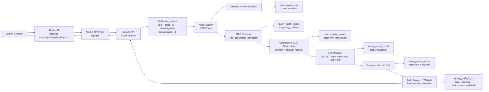
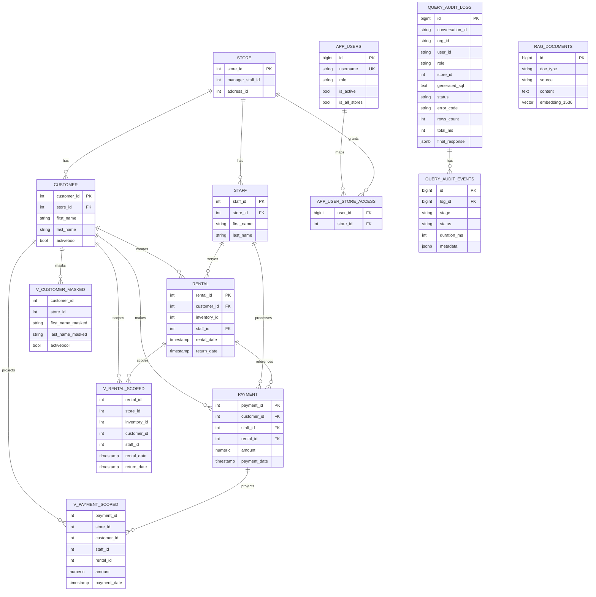

# Architecture + Database Diagrams

This file combines both existing diagrams:
- Runtime request flow
- Database ER diagram

## 1) Runtime Flow

```mermaid
flowchart LR
    U["User in Browser"] --> F["Next.js UI\nfrontend-nextjs/app/analytics/page.tsx"]
    F --> P["Next.js API Proxy\n/api/ask"]
    P --> B["NestJS API\nPOST /api/ask"]
    B --> C["Build user_context\nrole + store_id + allowed_views\nconversation_id"]
    C --> A["Agno FastAPI\nPOST /run"]

    A --> T["Validate X-Internal-Token"]
    T --> L0["query_audit_logs\nstatus=received"]

    A --> R["RAG Retrieval\nrag_documents (pgvector)"]
    R --> L1["query_audit_events\nstage=rag_retrieval"]

    R --> M["OpenRouter SQL Generation\nprimary + fallback models"]
    M --> L2["query_audit_events\nstage=llm_generation"]

    M --> V["SQL Validator\nSELECT-only, views-only, LIMIT 200"]
    V --> L3["query_audit_events\nstage=validation"]

    V --> D["Postgres Execute SQL"]
    D --> L4["query_audit_events\nstage=db_execution"]

    D --> W["Build Answer + Widgets\nline/bar/pie/table/metric"]
    W --> L5["query_audit_logs\nfinal_response, status=success/failed"]

    W --> B
    B --> P
    P --> F
    F --> U
```

## 2) Database ER Diagram

```mermaid
erDiagram
    STORE ||--o{ CUSTOMER : has
    STORE ||--o{ STAFF : has
    CUSTOMER ||--o{ PAYMENT : makes
    CUSTOMER ||--o{ RENTAL : creates
    STAFF ||--o{ PAYMENT : processes
    STAFF ||--o{ RENTAL : serves
    RENTAL ||--o{ PAYMENT : references

    APP_USERS ||--o{ APP_USER_STORE_ACCESS : maps
    STORE ||--o{ APP_USER_STORE_ACCESS : grants

    QUERY_AUDIT_LOGS ||--o{ QUERY_AUDIT_EVENTS : has

    CUSTOMER ||--o{ V_PAYMENT_SCOPED : projects
    PAYMENT ||--o{ V_PAYMENT_SCOPED : projects
    CUSTOMER ||--o{ V_CUSTOMER_MASKED : masks
    CUSTOMER ||--o{ V_RENTAL_SCOPED : scopes
    RENTAL ||--o{ V_RENTAL_SCOPED : scopes

    STORE {
      int store_id PK
      int manager_staff_id
      int address_id
    }
    CUSTOMER {
      int customer_id PK
      int store_id FK
      string first_name
      string last_name
      bool activebool
    }
    STAFF {
      int staff_id PK
      int store_id FK
      string first_name
      string last_name
    }
    RENTAL {
      int rental_id PK
      int customer_id FK
      int inventory_id
      int staff_id FK
      timestamp rental_date
      timestamp return_date
    }
    PAYMENT {
      int payment_id PK
      int customer_id FK
      int staff_id FK
      int rental_id FK
      numeric amount
      timestamp payment_date
    }

    APP_USERS {
      bigint id PK
      string username UK
      string role
      bool is_active
      bool is_all_stores
    }
    APP_USER_STORE_ACCESS {
      bigint user_id FK
      int store_id FK
    }

    RAG_DOCUMENTS {
      bigint id PK
      string doc_type
      string source
      text content
      vector embedding_1536
    }

    QUERY_AUDIT_LOGS {
      bigint id PK
      string conversation_id
      string org_id
      string user_id
      string role
      int store_id
      text generated_sql
      string status
      string error_code
      int rows_count
      int total_ms
      jsonb final_response
    }
    QUERY_AUDIT_EVENTS {
      bigint id PK
      bigint log_id FK
      string stage
      string status
      int duration_ms
      jsonb metadata
    }

    V_PAYMENT_SCOPED {
      int payment_id
      int store_id
      int customer_id
      int staff_id
      int rental_id
      numeric amount
      timestamp payment_date
    }
    V_CUSTOMER_MASKED {
      int customer_id
      int store_id
      string first_name_masked
      string last_name_masked
      bool activebool
    }
    V_RENTAL_SCOPED {
      int rental_id
      int store_id
      int inventory_id
      int customer_id
      int staff_id
      timestamp rental_date
      timestamp return_date
    }
```
