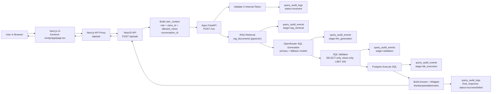

# Flow Diagram (Safe)



## PNG Export

Option 1 (`npx`):
```bash
npx -y @mermaid-js/mermaid-cli -i FLOW_DIAGRAM_SAFE.md -o FLOW_DIAGRAM.png
```

Option 2 (Docker):
```bash
docker run --rm -v "$PWD:/data" minlag/mermaid-cli -i /data/FLOW_DIAGRAM_SAFE.md -o /data/FLOW_DIAGRAM.png
```
