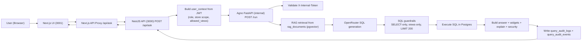

# AI Analytics Copilot

Production-style analytics copilot with:
- Next.js frontend
- NestJS API gateway
- Internal Agno/FastAPI workflow service
- Postgres + pgvector + Pagila sample data

## Overview

This project lets users ask natural language analytics questions with strict role/store scoping.  
Backend enforces JWT scope, Agno enforces SQL guardrails, and all requests are audit logged.

## Services

- `frontend-nextjs` (public): `http://localhost:3001`
- `backend-nestjs` (public): `http://localhost:3000`
- `agno-python` (internal only): no host port
- `postgres` (`pgvector/pgvector:pg16`): `localhost:5433`

## Prerequisites

- Docker + Docker Compose
- Git
- Pagila SQL files in repo root:
  - `pagila-schema.sql`
  - `pagila-data.sql`

Download source:
`https://www.postgresql.org/ftp/projects/pgFoundry/dbsamples/pagila/pagila/`

## Quick Start

1. Start services
```bash
docker compose up -d --build
```

2. Import Pagila (PowerShell)
```powershell
Get-Content .\pagila-schema.sql | docker compose exec -T postgres psql -U postgres -d pagila
Get-Content .\pagila-data.sql | docker compose exec -T postgres psql -U postgres -d pagila
```

3. Apply project SQL (PowerShell)
```powershell
Get-Content .\agno-python\sql\001_rag.sql | docker compose exec -T postgres psql -U postgres -d pagila
Get-Content .\agno-python\sql\002_seed_rag.sql | docker compose exec -T postgres psql -U postgres -d pagila
Get-Content .\agno-python\sql\002_scoped_views.sql | docker compose exec -T postgres psql -U postgres -d pagila
Get-Content .\agno-python\sql\003_query_audit_logs.sql | docker compose exec -T postgres psql -U postgres -d pagila
Get-Content .\agno-python\sql\004_query_audit_enhancements.sql | docker compose exec -T postgres psql -U postgres -d pagila
Get-Content .\agno-python\sql\005_auth_users_roles.sql | docker compose exec -T postgres psql -U postgres -d pagila
```

4. Open app
- Login: `http://localhost:3001/login`
- Analytics: `http://localhost:3001/analytics`

## Seed Login Users

- `admin_user / admin123` (all stores)
- `manager_store1 / manager123` (store 1)
- `manager_multi / manager123` (stores 1,2)
- `marketing_user / marketing123` (stores 1,2)
- `finance_user / finance123` (store 1)

## Environment

Set in `.env`:
```env
OPENROUTER_BASE_URL=https://openrouter.ai/api/v1
OPENROUTER_API_KEY=your_key_here
OPENROUTER_MODEL=meta-llama/llama-3.2-3b-instruct:free
OPENROUTER_FALLBACK_MODELS=google/gemma-2-9b-it:free,microsoft/phi-3-mini-128k-instruct:free,qwen/qwen2.5-7b-instruct:free
AGNO_TIMEOUT_MS=45000
AGNO_TELEMETRY=false
AGNO_DISABLE_TELEMETRY=true
PHI_TELEMETRY=false
JWT_SECRET=change-me
INTERNAL_TOKEN=change-me
```

## API Usage

- Login: `POST /api/auth/login`
- Ask: `POST /api/ask`

Example ask payload:
```json
{
  "question": "What is total revenue for my store 1?",
  "role": "store_manager",
  "store_id": 1
}
```

## Diagnostics

Quick checks:
```powershell
docker compose ps
docker compose logs --tail=100 backend-nestjs
docker compose logs --tail=100 agno-python
docker compose exec -T postgres psql -U postgres -d pagila -c "SELECT COUNT(*) FROM payment;"
docker compose exec -T postgres psql -U postgres -d pagila -c "SELECT COUNT(*) FROM rag_documents;"
docker compose exec -T postgres psql -U postgres -d pagila -c "SELECT id, conversation_id, status, error_stage, created_at FROM query_audit_logs ORDER BY id DESC LIMIT 10;"
docker compose exec -T postgres psql -U postgres -d pagila -c "SELECT id, log_id, stage, status, duration_ms, created_at FROM query_audit_events ORDER BY id DESC LIMIT 20;"
```

## Testing

Backend smoke tests (from `backend-nestjs`):
```powershell
npm run test:smoke
```

Coverage includes:
- login success/failure
- invalid JWT rejection
- store scope enforcement
- admin all-store behavior
- multi-store manager behavior
- finance scope restrictions

## Architecture Flow Diagram



## Failure Points (Troubleshooting)

1. `401 Invalid JWT token`: re-login, verify `JWT_SECRET`.
2. `403 Requested store is outside your access scope`: choose assigned store.
3. `401 Invalid internal token`: sync `INTERNAL_TOKEN` across backend and agno.
4. `429` / `402` from OpenRouter: retry, switch model, check provider limits.
5. SQL validator block (`View not allowed`, `Only SELECT/CTE`): use role-scoped read-only prompts.
6. `500 Database execution failed`: verify Pagila import and SQL migration order.

## Diagrams

- Combined flow + ER: `ARCHITECTURE_DIAGRAMS.md`
- ER-focused: `DB_ERD.md`
