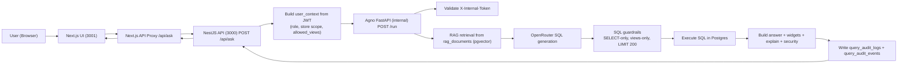

# AI Analytics Copilot

Production-style analytics copilot with:
- Next.js frontend
- NestJS API gateway
- Internal Agno/FastAPI workflow service
- Postgres + pgvector + Pagila sample data

## Overview

This project starts with the PostgreSQL Pagila sample database and extends it into a real-world analytics copilot use case.  
It adds role-aware access control, scoped analytics views, JWT-based API authorization, RAG context with pgvector, SQL safety guardrails, and end-to-end audit logging.  
The result is a practical reference architecture for turning sample relational data into a secure AI analytics workflow.

## Project Context

### Business Use Case

From sample DVD rental data to a multi-role analytics assistant:
- `admin`: cross-store revenue, rental, and masked customer analysis
- `store_manager`: store-level payments and rentals for assigned stores
- `marketing`: masked customer segmentation/trends without payment-level exposure
- `finance`: payment and revenue-focused reporting

### Data Model Extensions Over Pagila

Added on top of sample schema:
- Scoped views: `v_payment_scoped`, `v_rental_scoped`, `v_customer_masked`
- RAG store: `rag_documents` (pgvector embeddings)
- Access control: `app_users`, `app_user_store_access`
- Audit/trace: `query_audit_logs`, `query_audit_events`

### Security Model

- JWT claims used by backend: `user_id`, `role`, `store_ids`, `is_all_stores`
- Backend enforces store scope for every `/api/ask` request
- Agno internal endpoint protected by `X-Internal-Token`
- Current PII protection:
  - customer names are exposed only via masked view fields (`first_name_masked`, `last_name_masked`) in `v_customer_masked`
  - marketing role is restricted to masked customer view
  - SQL guardrails restrict queries to role-allowed scoped views
- PII policy engine is planned as the next enhancement (keyword/column checks + audit decision logging)
- SQL guardrails enforce:
  - single statement
  - `SELECT` / `WITH ... SELECT` only
  - allowed views only
  - `LIMIT 200` maximum

### Prompting Strategy

- UI provides role-based prompt suggestions mapped to role-allowed views
- In-scope prompts are designed to produce safe executable SQL
- Out-of-scope prompts are blocked with clear validation/scope errors

### RAG Strategy

- Seeded docs include schema hints, metric glossary, governance/safety rules, and widget hints
- Retrieval context is injected before SQL generation to reduce hallucinations and improve view selection

### Observability and Audit

- `conversation_id` is created at API entry and propagated end-to-end
- Each workflow stage writes audit events (`rag_retrieval`, `llm_generation`, `validation`, `db_execution`, `completed`)
- Final response, SQL, timings, and error metadata are persisted for troubleshooting

### Known Limitations

- Free OpenRouter models can hit rate/spend limits (`429` / `402`)
- SQL generation can still need deterministic fallback/rewrite for edge cases
- Pagila is sample data and does not represent full production domain complexity

### Production Hardening Next Steps

- Replace seed login with real identity provider (OIDC/SAML) and RBAC service
- Introduce explicit org/tenant data model and policy management
- Add result caching and resilient retries/circuit-breakers around model calls
- Add CI pipeline for lint/build/smoke tests and migration checks

## Agno Features Implemented / Explored

The internal `agno-python` service uses a modular workflow design aligned with Agno-style agent responsibilities:

- `SchemaRagAgent` and `KnowledgeAgent`
  - Retrieve and format context from `rag_documents` (pgvector-backed retrieval)
- `PlannerAgent`
  - Classifies intent (kpi/trend/ranking/distribution/comparison) for response shaping
- `SQLAgent`
  - Generates SQL via OpenRouter (primary + fallback model support)
  - Supports conversation-aware context via lightweight memory history
- `Validator`
  - Enforces SQL safety before execution
- `DBTool`
  - Executes validated SQL against Postgres
- `InsightAgent` and `NarratorAgent`
  - Summarize result rows into user-facing explanation
- `WidgetAgent`
  - Produces visualization-ready widget payloads (table/metric/bar/line/pie)

Operational features around this workflow:
- Role/store scoped querying using allowed views
- Strict SQL guardrails (SELECT/CTE, one statement, forbidden keyword block, LIMIT enforcement)
- Internal service protection using `X-Internal-Token`
- OpenRouter model fallback and rate-limit handling
- End-to-end audit trail in `query_audit_logs` and `query_audit_events` with stage-level metadata

### Implemented Today

- Workflow pipeline for retrieval -> SQL generation -> validation -> execution -> narration
- Basic conversation context memory (short window)
- Knowledge retrieval from `rag_documents`
- Guardrails for SQL safety and scope control
- Widget-oriented structured response output
- Stage-wise observability in audit tables

### Explored / Planned Next (Agno Expansion)

- Rich memory layers:
  - per-conversation memory
  - per-user preference memory
  - per-org policy memory
- Tool expansion:
  - document ingestion tools
  - export/report tools
  - metadata/schema introspection tools
- Advanced guardrails:
  - PII policy checks
  - dynamic policy blocks by role/org
  - risk scoring before execution
- HITL (Human-in-the-Loop):
  - approval queue for risky/high-impact SQL
  - approve/reject workflow before DB execution
- Prompt packs:
  - org/role/user prompt blocks
  - versioned prompt configuration without code changes
- Evaluation and quality loop:
  - capture interactions for quality review
  - SQL/answer quality scoring
  - dataset export for future tuning/model experiments

## Services

- `frontend-nextjs` (public): `http://localhost:3001`
- `backend-nestjs` (public): `http://localhost:3000`
- `agno-python` (internal only): no host port
- `postgres` (`pgvector/pgvector:pg16`): `localhost:5433`

## Prerequisites

- Docker + Docker Compose
- Git
- Pagila SQL files in repo root:
  - `pagila-schema.sql`
  - `pagila-data.sql`

Download source:
`https://www.postgresql.org/ftp/projects/pgFoundry/dbsamples/pagila/pagila/`

## Quick Start

1. Start services
```bash
docker compose up -d --build
```

2. Import Pagila (PowerShell)
```powershell
Get-Content .\pagila-schema.sql | docker compose exec -T postgres psql -U postgres -d pagila
Get-Content .\pagila-data.sql | docker compose exec -T postgres psql -U postgres -d pagila
```

3. Apply project SQL (PowerShell)
```powershell
Get-Content .\agno-python\sql\001_rag.sql | docker compose exec -T postgres psql -U postgres -d pagila
Get-Content .\agno-python\sql\002_seed_rag.sql | docker compose exec -T postgres psql -U postgres -d pagila
Get-Content .\agno-python\sql\002_scoped_views.sql | docker compose exec -T postgres psql -U postgres -d pagila
Get-Content .\agno-python\sql\003_query_audit_logs.sql | docker compose exec -T postgres psql -U postgres -d pagila
Get-Content .\agno-python\sql\004_query_audit_enhancements.sql | docker compose exec -T postgres psql -U postgres -d pagila
Get-Content .\agno-python\sql\005_auth_users_roles.sql | docker compose exec -T postgres psql -U postgres -d pagila
```

4. Open app
- Login: `http://localhost:3001/login`
- Analytics: `http://localhost:3001/analytics`

## Seed Login Users

- `admin_user / admin123` (all stores)
- `manager_store1 / manager123` (store 1)
- `manager_multi / manager123` (stores 1,2)
- `marketing_user / marketing123` (stores 1,2)
- `finance_user / finance123` (store 1)

## Environment

Set in `.env`:
```env
OPENROUTER_BASE_URL=https://openrouter.ai/api/v1
OPENROUTER_API_KEY=your_key_here
OPENROUTER_MODEL=meta-llama/llama-3.2-3b-instruct:free
OPENROUTER_FALLBACK_MODELS=google/gemma-2-9b-it:free,microsoft/phi-3-mini-128k-instruct:free,qwen/qwen2.5-7b-instruct:free
AGNO_TIMEOUT_MS=45000
AGNO_TELEMETRY=false
AGNO_DISABLE_TELEMETRY=true
PHI_TELEMETRY=false
JWT_SECRET=change-me
INTERNAL_TOKEN=change-me
```

## API Usage

- Login: `POST /api/auth/login`
- Ask: `POST /api/ask`

Example ask payload:
```json
{
  "question": "What is total revenue for my store 1?",
  "role": "store_manager",
  "store_id": 1
}
```

## Diagnostics

Quick checks:
```powershell
docker compose ps
docker compose logs --tail=100 backend-nestjs
docker compose logs --tail=100 agno-python
docker compose exec -T postgres psql -U postgres -d pagila -c "SELECT COUNT(*) FROM payment;"
docker compose exec -T postgres psql -U postgres -d pagila -c "SELECT COUNT(*) FROM rag_documents;"
docker compose exec -T postgres psql -U postgres -d pagila -c "SELECT id, conversation_id, status, error_stage, created_at FROM query_audit_logs ORDER BY id DESC LIMIT 10;"
docker compose exec -T postgres psql -U postgres -d pagila -c "SELECT id, log_id, stage, status, duration_ms, created_at FROM query_audit_events ORDER BY id DESC LIMIT 20;"
```

## Testing

Backend smoke tests (from `backend-nestjs`):
```powershell
npm run test:smoke
```

Coverage includes:
- login success/failure
- invalid JWT rejection
- store scope enforcement
- admin all-store behavior
- multi-store manager behavior
- finance scope restrictions

## Architecture Flow Diagram



## Failure Points (Troubleshooting)

1. `401 Invalid JWT token`: re-login, verify `JWT_SECRET`.
2. `403 Requested store is outside your access scope`: choose assigned store.
3. `401 Invalid internal token`: sync `INTERNAL_TOKEN` across backend and agno.
4. `429` / `402` from OpenRouter: retry, switch model, check provider limits.
5. SQL validator block (`View not allowed`, `Only SELECT/CTE`): use role-scoped read-only prompts.
6. `500 Database execution failed`: verify Pagila import and SQL migration order.

## Diagrams

- Combined flow + ER: `ARCHITECTURE_DIAGRAMS.md`
- ER-focused: `DB_ERD.md`
