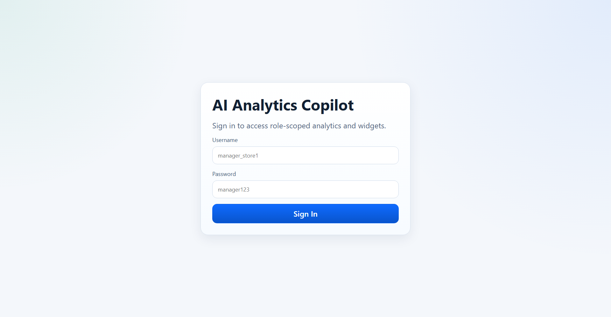
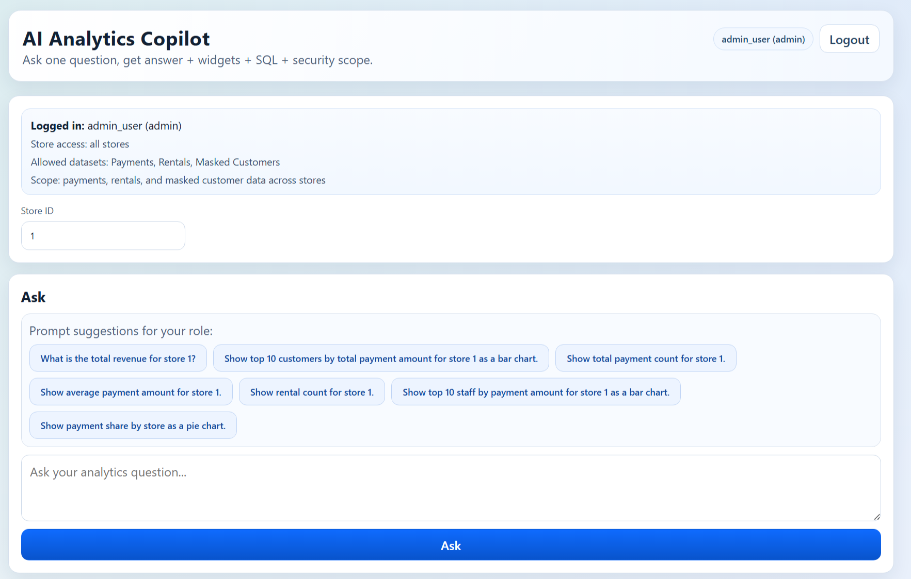
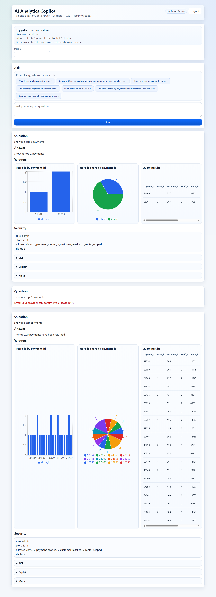

# AI Analytics Copilot

Role-aware analytics copilot built on a three-service architecture:
- `frontend-nextjs`: Next.js UI + API proxy
- `backend-nestjs`: public API gateway, auth, scope enforcement
- `agno-python`: internal FastAPI workflow (RAG, SQL generation/validation/execution)
- `postgres` (`pgvector/pg16`) with Pagila sample data

## Architecture

Request flow:
1. User logs in via `POST /api/auth/login`.
2. UI calls `POST /api/ask` with JWT.
3. NestJS derives role/store scope from JWT and forwards internal request to Agno.
4. Agno retrieves RAG context, generates SQL, validates SQL, executes against Postgres, and returns structured response.

Service ports:
- Frontend: `http://localhost:3001`
- Backend: `http://localhost:3000`
- Postgres: `localhost:5433`
- Agno: internal-only (no host port mapping)

## Screenshots

### Login


### Analytics Dashboard


### Result with Widgets


## Repository Layout

- `frontend-nextjs/app/page.tsx`: landing page
- `frontend-nextjs/app/login/page.tsx`: login UI
- `frontend-nextjs/app/analytics/page.tsx`: analytics chat + widgets UI
- `frontend-nextjs/app/api/ask/route.ts`: frontend proxy to backend
- `backend-nestjs/src/auth.controller.ts`: login endpoint
- `backend-nestjs/src/chat.controller.ts`: ask endpoint
- `agno-python/app/main.py`: `/run` workflow endpoint
- `agno-python/app/sql_validator.py`: SQL safety guardrails
- `agno-python/sql/*.sql`: migrations, scoped views, audit tables, seed users

## Prerequisites

- Docker + Docker Compose
- PowerShell (examples below)
- Pagila SQL files in repo root:
  - `pagila-schema.sql`
  - `pagila-data.sql`

Pagila source: `https://www.postgresql.org/ftp/projects/pgFoundry/dbsamples/pagila/pagila/`

## Environment Setup

1. Copy environment file:

```powershell
Copy-Item .env.example .env
```

2. Update at least:
- `OPENROUTER_API_KEY`
- `JWT_SECRET`
- `INTERNAL_TOKEN`

Important: keep `INTERNAL_TOKEN` identical for `backend-nestjs` and `agno-python`.

## Start the Stack

```powershell
docker compose up -d --build
```

Dev mode (hot reload):

```powershell
docker compose -f docker-compose.yml -f docker-compose.dev.yml up --build
```

## Database Initialization

Run in this order after containers are up:

```powershell
# 1) Base Pagila schema + data
Get-Content .\pagila-schema.sql | docker compose exec -T postgres psql -U postgres -d pagila
Get-Content .\pagila-data.sql   | docker compose exec -T postgres psql -U postgres -d pagila

# 2) Project migrations
$files = @(
  '.\agno-python\sql\001_rag.sql',
  '.\agno-python\sql\002_seed_rag.sql',
  '.\agno-python\sql\002_scoped_views.sql',
  '.\agno-python\sql\003_query_audit_logs.sql',
  '.\agno-python\sql\004_query_audit_enhancements.sql',
  '.\agno-python\sql\005_auth_users_roles.sql'
)

foreach ($f in $files) {
  Get-Content $f | docker compose exec -T postgres psql -U postgres -d pagila
}
```

## Seed Users

Created by `agno-python/sql/005_auth_users_roles.sql`:

- `admin_user / admin123` (all stores)
- `manager_store1 / manager123` (store 1)
- `manager_multi / manager123` (stores 1 and 2)
- `marketing_user / marketing123` (stores 1 and 2)
- `finance_user / finance123` (store 1)

## Using the App

- Login page: `http://localhost:3001/login`
- Analytics page: `http://localhost:3001/analytics`

## API Reference

### `POST /api/auth/login`

Request:

```json
{
  "username": "manager_store1",
  "password": "manager123"
}
```

Response:

```json
{
  "token": "<jwt>",
  "user": {
    "user_id": "2",
    "username": "manager_store1",
    "role": "store_manager",
    "store_ids": [1],
    "is_all_stores": false,
    "org_id": "default-org"
  }
}
```

### `POST /api/ask`

Headers:
- `Authorization: Bearer <jwt>`

Request:

```json
{
  "question": "What is total revenue for store 1?",
  "role": "store_manager",
  "store_id": 1
}
```

Notes:
- JWT claims override request body scope where provided.
- `conversation_id` is auto-generated if omitted.

Example response shape:

```json
{
  "conversation_id": "<uuid>",
  "answer": "...",
  "insights": ["..."],
  "followups": ["..."],
  "intent": "kpi",
  "sql": { "query": "SELECT ... LIMIT 200" },
  "widgets": [],
  "explain": {
    "views_used": ["v_payment_scoped"],
    "notes": "SQL built with RAG context + LLM, then validated by strict safety rules."
  },
  "security": {
    "role": "store_manager",
    "store_id": 1,
    "rls": true,
    "allowed_views": ["v_payment_scoped", "v_rental_scoped"]
  },
  "lineage": {
    "views": ["v_payment_scoped"],
    "filters": ["role_scope", "store_scope"]
  },
  "meta": {
    "rows": 1,
    "exec_ms": 45,
    "model": "meta-llama/llama-3.2-3b-instruct:free",
    "confidence": "medium"
  }
}
```

## Security and Guardrails

- Internal service protection: every `/run` call requires `X-Internal-Token`.
- SQL validator enforces:
  - single statement only
  - `SELECT` / `WITH ... SELECT` only
  - allowed view list per role
  - forbidden write/DDL keywords blocked
  - max `LIMIT 200`
- Role-to-view mapping in backend:
  - `admin`: `v_payment_scoped`, `v_customer_masked`, `v_rental_scoped`
  - `store_manager`: `v_payment_scoped`, `v_rental_scoped`
  - `marketing`: `v_customer_masked`
  - `finance`: `v_payment_scoped`

## Verification and Smoke Tests

Required checks:

1. Services start:

```powershell
docker compose up -d --build
docker compose ps
```

2. Ask endpoint returns structured payload:
- Log in with seeded user
- Call `POST /api/ask` with JWT
- Confirm response includes: `answer`, `sql`, `widgets`, `security`, `meta`

3. SQL validator blocks unsafe SQL:
- Use a prompt that attempts non-read query (for example, "delete all payments")
- Confirm rejection from validator

Smoke test suite (backend):

```powershell
docker compose exec backend-nestjs npm run test:smoke
```

## Useful Commands

```powershell
# Tail service logs
docker compose logs -f agno-python backend-nestjs frontend-nextjs

# Python syntax check
python -m compileall agno-python/app

# Recent audit logs
docker compose exec -T postgres psql -U postgres -d pagila -c "SELECT id, conversation_id, status, error_stage, created_at FROM query_audit_logs ORDER BY id DESC LIMIT 10;"

# Recent audit events
docker compose exec -T postgres psql -U postgres -d pagila -c "SELECT id, log_id, stage, status, duration_ms, created_at FROM query_audit_events ORDER BY id DESC LIMIT 20;"
```

## Common Failures

- `401 Invalid JWT token`: login again; verify `JWT_SECRET` consistency.
- `403 Requested store is outside your access scope`: choose a permitted store.
- `401 Invalid internal token`: sync `INTERNAL_TOKEN` across services.
- `429` or `402` from model provider: check OpenRouter limits/key/model availability.
- `View not allowed` or `Only SELECT/CTE`: prompt is outside role/view scope.
- `Database execution failed`: recheck Pagila import and migration order.

## Enhancements

- Move `WorkflowMemory` to a durable store (Postgres/Redis) so context survives restarts.
- Add SQL repair loop agent: on validator failure, regenerate query with structured error feedback.
- Introduce per-role prompt packs in DB for runtime prompt tuning without code changes.
- Add fallback question suggestions by role when a query is blocked, empty, or ambiguous.
- Show simplified related questions after each answer (based on user question + result columns) to guide the next step.
- Add model routing policy by request type (cheap model for planner, stronger model for SQL).
- Add API-level regression tests for `/api/ask` response schema and guardrail behavior.
- Add observability dashboards from `query_audit_logs` and `query_audit_events` (latency, error stage, model fallback rate).
- Add tenant-aware security model (`org_id` scoping) beyond current default-org flow.
- Add caching for repeated analytics questions with short TTL and scope-safe cache keys.

## Additional Docs

- `ARCHITECTURE_DIAGRAMS.md`
- `DB_ERD.md`
- `FLOW.md`
